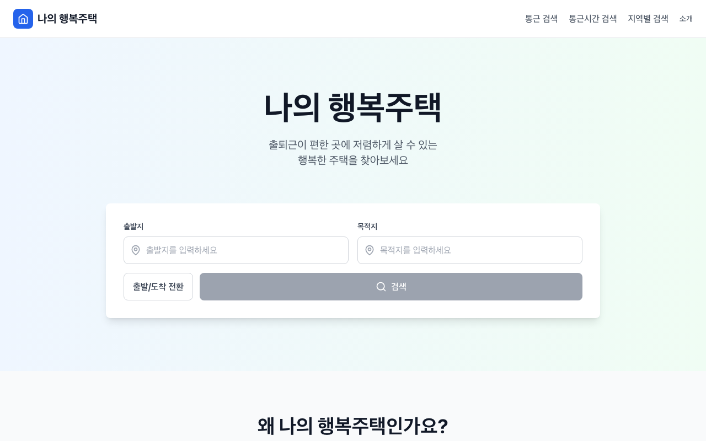
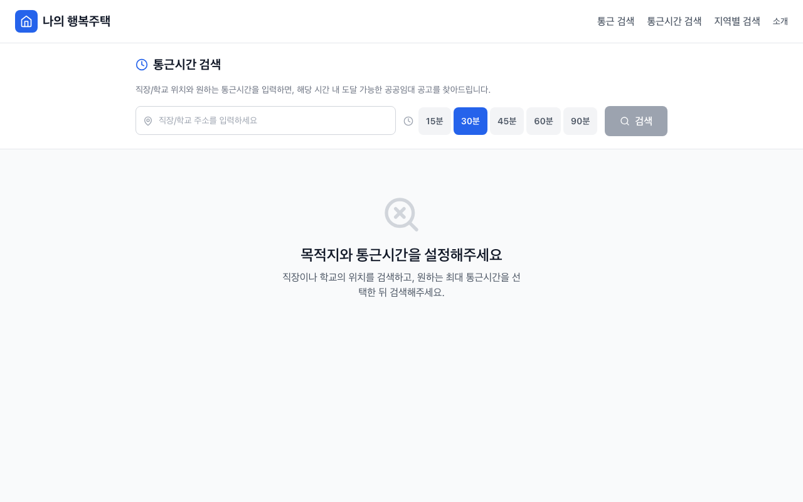
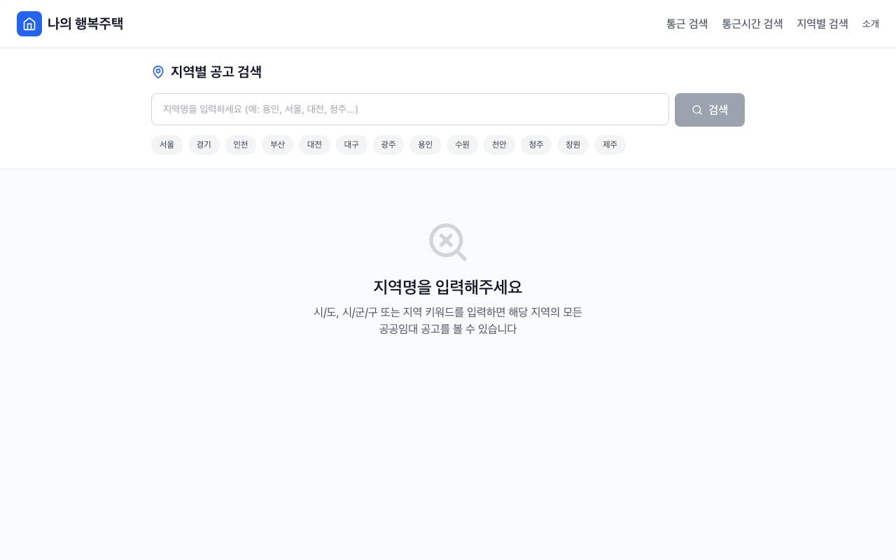
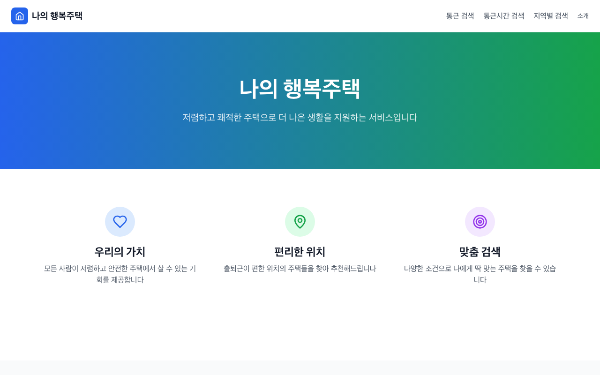

# 나의 행복주택

출발지-도착지 대중교통 경로 기반 공공임대주택(행복주택, 국민임대, LH 등) 통합 검색 서비스

## 화면 미리보기

### 메인 페이지
출발지/도착지를 입력하여 경로 기반 공공임대주택을 검색할 수 있습니다.



### 통근시간 검색
직장/학교 위치와 원하는 통근시간을 설정하면, 해당 시간 내 도달 가능한 공공임대 공고를 찾아줍니다.



### 지역별 검색
시/도, 시/군/구 또는 지역 키워드로 해당 지역의 공공임대 공고를 검색합니다.



### 서비스 소개
나의 행복주택이 제공하는 핵심 가치와 기능을 안내합니다.



### 모바일 반응형
모바일 환경에서도 최적화된 UI를 제공합니다.

<p align="center">
  
</p>

---

## 기술 스택

| 구분 | 기술 |
|------|------|
| Backend | Python 3.12 + Django 5 + DRF |
| Frontend | Next.js 14 + React 18 + TypeScript + Tailwind CSS |
| DB | PostgreSQL 16 + PostGIS |
| Cache/Queue | Redis + Celery Beat |
| 크롤링 | requests + BeautifulSoup (마이홈, LH, 청약홈) |
| 지도 | Kakao Map API |

## 사전 준비

### 필수 설치

- [Docker Desktop](https://www.docker.com/products/docker-desktop/) (권장) 또는 아래 개별 설치:
  - Python 3.12+
  - Node.js 20+
  - PostgreSQL 16 + PostGIS
  - Redis 7

### Kakao API 키 발급

1. [Kakao Developers](https://developers.kakao.com/) 접속 후 로그인
2. **내 애플리케이션** > **애플리케이션 추가하기**
3. 앱 생성 후 **앱 키** 탭에서:
   - **REST API 키** -> `KAKAO_API_KEY` (백엔드 경로/지오코딩용)
   - **JavaScript 키** -> `KAKAO_MAP_KEY` (프론트엔드 지도 렌더링용)
4. **플랫폼** 탭에서 Web 도메인 등록: `http://localhost:3000`

### 환경변수 설정

```bash
cp .env.example .env
```

`.env` 파일을 열어 Kakao API 키를 입력:

```env
KAKAO_API_KEY=발급받은_REST_API_키
KAKAO_MAP_KEY=발급받은_JavaScript_키
NEXT_PUBLIC_KAKAO_MAP_KEY=발급받은_JavaScript_키  # 위와 동일
```

---

## Docker로 실행 (권장)

### 전체 서비스 한번에 실행

```bash
docker compose up -d
```

실행되는 서비스:

| 서비스 | 설명 | 포트 |
|--------|------|------|
| `db` | PostgreSQL 16 + PostGIS | 5432 |
| `redis` | Redis 7 | 6379 |
| `backend` | Django API 서버 | 8000 |
| `frontend` | Next.js 개발 서버 | 3000 |
| `celery-worker` | 크롤링 비동기 작업 처리 | - |
| `celery-beat` | 크롤링 스케줄러 | - |

> `backend` 컨테이너가 시작 시 자동으로 `migrate` + `load_static_data`를 실행합니다.

### 초기 데이터 로드 (fixture)

첫 실행 시 크롤링 데이터가 없으므로, fixture에서 로드합니다:

```bash
docker compose exec backend python manage.py load_fixtures
```

### 로그 확인

```bash
# 전체 로그
docker compose logs -f

# 특정 서비스 로그
docker compose logs -f backend
docker compose logs -f celery-worker
```

### 서비스 관리

```bash
# 중지
docker compose down

# 중지 + DB 볼륨 삭제 (데이터 초기화)
docker compose down -v

# 특정 서비스만 재시작
docker compose restart backend
```

---

## 로컬 개발 (Docker 없이)

PostgreSQL(PostGIS), Redis가 로컬에 설치되어 있어야 합니다.

### Backend

```bash
cd backend

# 가상환경 생성 및 활성화
python -m venv venv
source venv/bin/activate  # Windows: venv\Scripts\activate

# 의존성 설치
pip install -r requirements/local.txt

# DB 마이그레이션
python manage.py migrate

# 정적 데이터 로드 (자격요건, 보증금 테이블 등)
python manage.py load_static_data

# 크롤링 데이터 로드 (fixture)
python manage.py load_fixtures

# 개발 서버 실행
python manage.py runserver
```

### Frontend

```bash
cd frontend

# 의존성 설치
npm install

# 개발 서버 실행
npm run dev
```

### 접속

- Frontend: http://localhost:3000
- Backend API: http://localhost:8000/api/v1/
- Django Admin: http://localhost:8000/admin/

---

## 크롤링

3개 공공주택 사이트에서 모집공고 데이터를 크롤링합니다.

| 소스 | 사이트 | 커맨드 |
|------|--------|--------|
| MyHome | myhome.go.kr (마이홈포털) | `crawl_myhome` |
| LH | apply.lh.or.kr (LH 청약센터) | `crawl_lh` |
| ApplyHome | applyhome.co.kr (청약홈) | `crawl_applyhome` |

### 수동 크롤링

```bash
# 크롤링만 (DB 저장 X, 확인용)
python manage.py crawl_myhome

# 크롤링 + DB 저장
python manage.py crawl_myhome --save --pages=3
python manage.py crawl_lh --save --pages=3
python manage.py crawl_applyhome --save --pages=3
```

### 자동 크롤링 (Celery Beat)

Docker 환경에서 `celery-beat`가 자동으로 스케줄링합니다:

| 스케줄 | 시간 | 대상 |
|--------|------|------|
| 매일 | 새벽 3시 | MyHome |
| 매주 일요일 | 새벽 5시 | 전체 (MyHome + LH + ApplyHome) |

크롤링 성공 시 fixture 파일(`fixtures/housing_data.json`)이 자동 갱신됩니다.

### Fixture 관리

```bash
# DB -> fixture 덤프 (크롤링 후 수동 갱신)
python manage.py dump_fixtures

# fixture -> DB 로드 (클론 후 초기 세팅)
python manage.py load_fixtures
```

---

## 주요 기능

### 경로 기반 검색
1. 출발지/도착지를 입력 (주소, 역명, 지명 자동완성)
2. 대중교통 경로(지하철/버스)를 탐색
3. 경로상 정류장/역 반경 내 공공임대 매물을 검색 (도보 5/10/15분)

### 필터링
- **대상 유형**: 청년, 신혼부부, 일반, 대학생, 고령자, 주거급여수급자
- **공급 유형**: 행복주택, 국민임대, 영구임대, 매입임대, 전세임대
- **보증금 범위**: 이중 슬라이더 (0~3억)
- **보증금 전환**: 최소전환/최대전환 금액 확인
- **모집 상태**: 모집중, 모집예정, 마감, 과거이력

### 정렬
보증금 낮은순, 월임대료 낮은순, 전용면적, 모집마감일 임박순, 최신 공고순 등

### 검색 결과
- **지도 뷰**: 경로 폴리라인 + 매물 핀 마커 (유형별 색상)
- **리스트 뷰**: 단지명, 면적, 보증금/월세, 전환금액, 대상, 마감일
- **반응형**: Desktop(좌 리스트 + 우 지도), Tablet(상 지도 + 하 리스트), Mobile(탭 전환)

### 상세 페이지
단지 기본 정보, 면적별 임대 조건 테이블, 대상별 자격요건, 모집 이력, 원본 공고 링크

---

## 프로젝트 구조

```
my-happy-housing/
├── backend/
│   ├── apps/
│   │   ├── housing/      # 주택 모델, API, 정적 데이터 로드
│   │   ├── crawler/      # 크롤링 spider, Celery task
│   │   └── route/        # 경로 탐색, 지오코딩
│   ├── config/           # Django 설정, Celery 설정
│   ├── data/             # JSON 정적 데이터 (자격요건, 보증금 테이블)
│   ├── fixtures/         # 크롤링 데이터 fixture
│   └── requirements/     # pip 의존성
├── frontend/
│   ├── src/
│   │   ├── app/          # Next.js App Router 페이지
│   │   ├── components/   # React 컴포넌트
│   │   └── lib/          # API 클라이언트, 유틸리티
│   └── public/
├── docs/                 # 설계 문서
├── docker-compose.yml
└── .env.example
```

---

## 테스트

```bash
# Backend
cd backend && python manage.py test

# Frontend
cd frontend && npm run test

# Lint
cd frontend && npm run lint
cd frontend && npm run type-check
```

---

## 문서

- [아키텍처](docs/ARCHITECTURE.md)
- [크롤링 전략](docs/CRAWLING_STRATEGY.md)
- [DB 스키마](docs/DATA_SCHEMA.md)
- [기능 명세](docs/FEATURE_SPEC.md)
- [API 명세](docs/API_SPEC.md)
- [프론트엔드 명세](docs/FRONTEND_SPEC.md)
